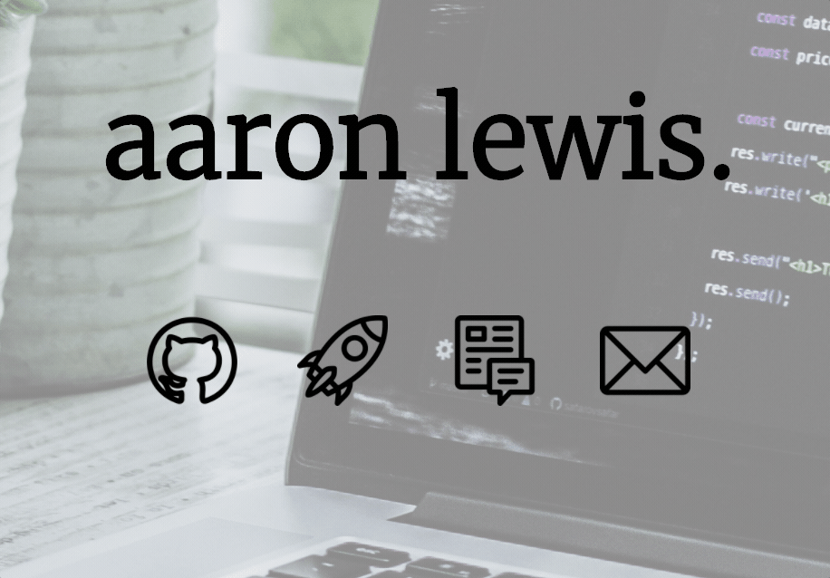
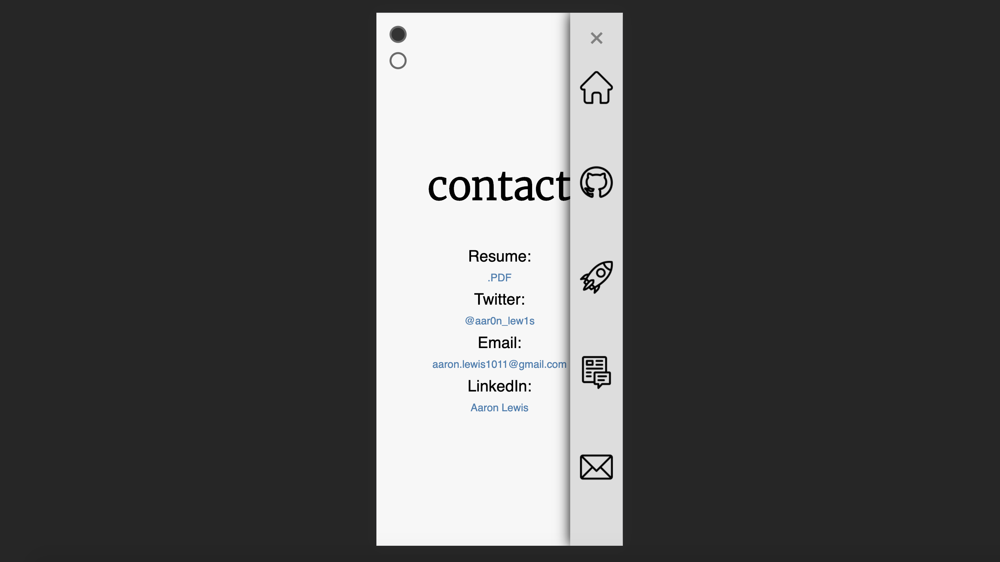
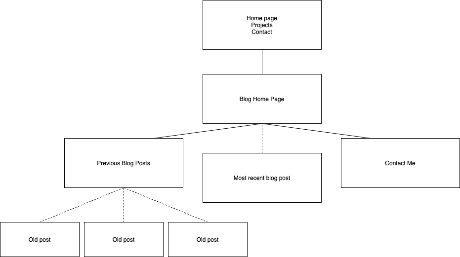
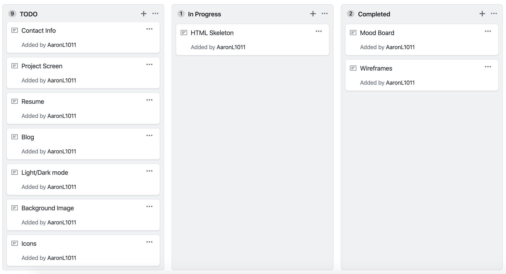
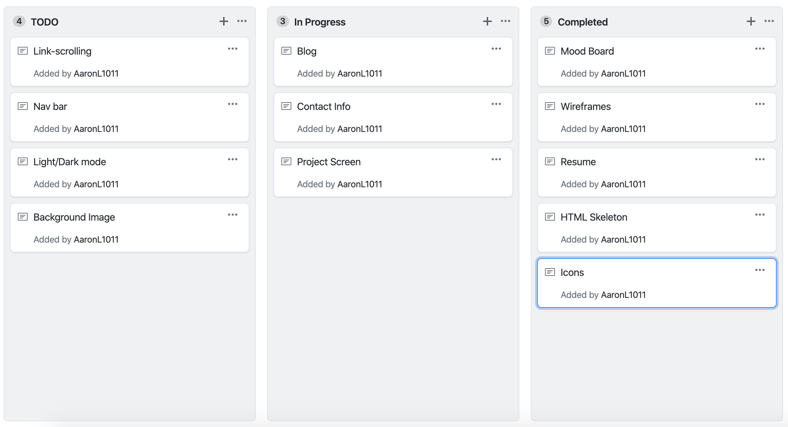
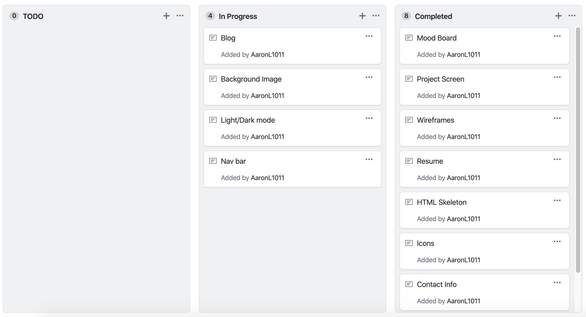
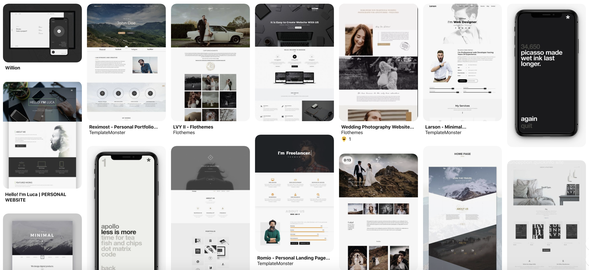
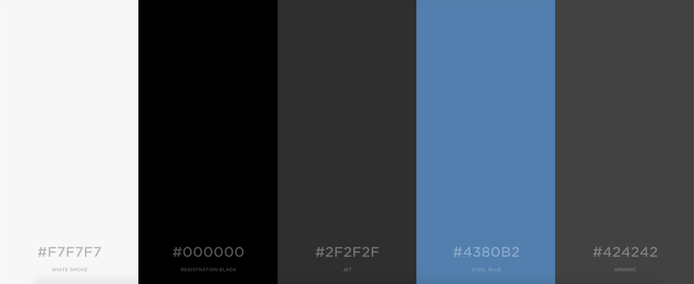
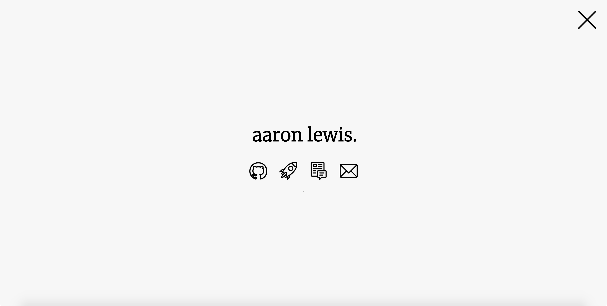

# Aaron Lewis

## Portfolio Website (T1A3)

Coder Academy 2019

### Github

[https://github.com/AaronL1011/aaronl1011.github.io](https://github.com/AaronL1011/aaronl1011.github.io)

### Website

[http://aaronlewis.io](http://aaronlewis.io)

## Purpose

The goal of this project is to create a visually and technically appealing website to demonstrate my abilities and coding experience.

This portfolio should be responsive and nicely formatted on all devices and include the required content such as:

- Name
- Contact Details
- Links to professional accounts (Github / LinkedIn)
- Work / Study History
- Projects Showcase
- Blog Posts w/ Sample Posts

## Functionality and Features

From the beginning of this project I have had some specific features in mind. I would like the website structure to be fairly minimalist (without compromising on styling) in order to focus the users eye to the more technical aspects (ie. how text responds to the cursor, navigation and fluidity of the website). As my career goal is to be more towards a backend developer, I want to highlight my abilities in getting technical functions and ideas to work properly. 

I think a really cool idea to implement is having the ability to switch between a Dark and a Light theme, which is becoming increasingly popular in the industry. I'd like the transitions to be very smooth and appealing to the user, staggering transition times between text, images and backgrounds to add further depth to the website.

I'd also like the bulk of the website to be on one html document. A home screen, projects screen and contact information screens all nagivated by icons on the home screen (and nav menu) which when clicked or tapped, scroll to anchors throughout the page. 

When positioning the Navigation menu, I want to be sure to place it in a region of the screen so mobile users with large devices won't struggle to reach the buttons (which is a pressing issue in this age of large smartphones and small hands).

I decided to position the navigation menu to the right side of the screen (sorry lefties) to make it easier to reach all the icons in the menu without straining too much.

## Sitemap

The home page, projects and contacts will all be located on the same HTML document. The blog will be its own seperate entity of html files, seperated from the portfolio as a project of its own.

## Target Audience

The target audiences of this project are any potential employers and industry professionals. This is going to be used to display my skills and history to companies that I am applying for jobs with, so I am not overly concerned about the average user not understanding tech jargon or inside-jokes. As long as a recruiter or other developer can appreciate my portfolio website, that will be a win in my books.

## Project Development

In order to track my progress throughout this project and keep on top of all my goals, I utilized Github Projects and created boards for TODO, In Progress and Completed tasks.

As far as design ideas, I made a mood board using Pinterest and gathered inspiration and ideas for the layout of my website. I knew from the start that I was going to keep the design predominantly monochromatic so I looked for as many minimalist, monochrome designs as I could.

For the color palette I used a palette generator website called Coolors.co

I started out by choosing flat black and a nice "off" shade of white. Then let the color generator cycle through some nice complimentary colors until I landed on a scheme that satisfied and from which I expanded on.

Initially I went with a somewhat generic style, I wanted to use a nice mountain landscape image as the background for the site, however after a while I fell out of love with the idea and failed to see the significance of a mountain in regards to coding, so I scrapped the whole site and started anew.

Iteration numero dos was much closer to the final design, still not quite there. I decided on going ULTRA minimal, as you can see. At the time the thought process behind this one was "I don't really want to be known for my design abilities, more-so rather my problem solving/backend skillset" however as time went on, while the aesthetic was cool and I did get some things right, I reconsidered and decided I was cutting myself short in not putting more effort into the graphical end of things.

Finally, I landed on this designed. It took a bit of trial and error finding the right background image, but overall I am really happy with the final feel of this layout. With the addition of a background with theme-adjustable shading, and an improved navbar, it was just enough UI improvements to show I'm not useless in the designing side of web development, and plenty of backend to prove I've got good abilities there aswell.

## Tech Stack

### Portolfio Website Creation

- HTML5
- CSS3
- Javascript
- JQuery

### Hosting Platform

- Github Pages

### Version Control System

- Git
- Github